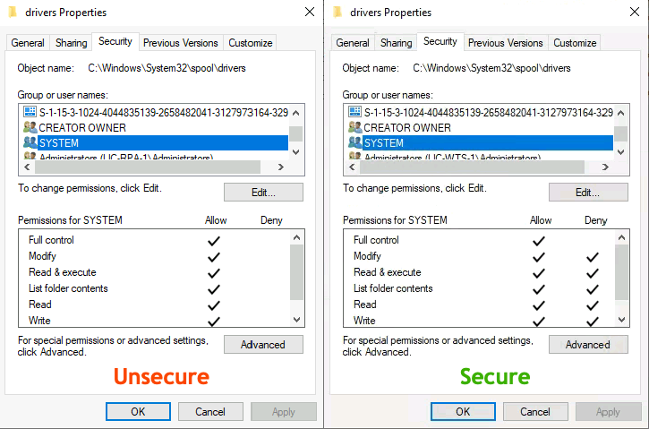
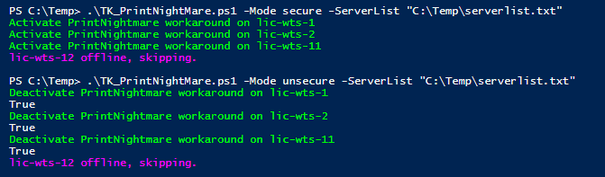

Author: Thomas Krampe
Copyright: 2021 by Thomas Krampe
Keywords: CVE-2021-1675,PowerShell,PrintNightmare 

# CVE-2021-1675 aka Print Nightmare Workaround
Just provide a text file with all your servers and run this script to prevent SYSTEM for adding malicious DLL's in your spool\drivers directory. For more informations and PoC of the attack visit https://github.com/thomasgeens/CVE-2021-1675.

Run 
`TK_PrintNightMare.ps1 -mode secure -Serverlist "C:\PathToYour\serverlist.txt"` 

to secure your Print Spooler, or

`TK_PrintNightMare.ps1 -mode unsecure -Serverlist "C:\PathToYour\serverlist.txt"` 

to change it back to normal/unsecure

That's it, but keep in mind that's only a workaround until a patch is available - watch this space https://msrc.microsoft.com/update-guide/vulnerability/CVE-2021-1675.

