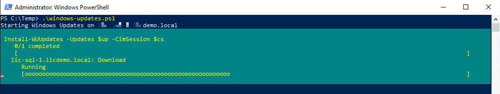
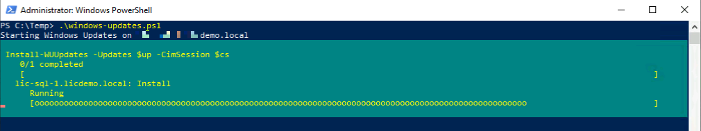
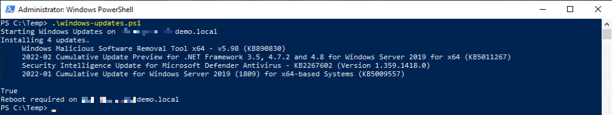

# Install Windows Updates
This script update your windows server based on a simple txt file (one machine per line). This file should be saved in the script directory.

If a reboot is required after installing updates, the target machine will be restarted automatically via 'Restart-Computer' CMDlet. If don't like this just comment out the particular line 90.

## Why sequential and not parallel?
You are right, a sequential run needs a lot of time but I want to make sure that the servers are up and running before continuing. You can control the reboot in the servers.txt for instance. Just start with your first domain controller for example and have your second domain controller in line 3, 4 or 5. This gives dc1 enough time to reboot before starting with dc2. But if you don't like my way of thinking, re-write my script to your needs.

## Screenshots
Download Updates

Installing Updates

Update finished

